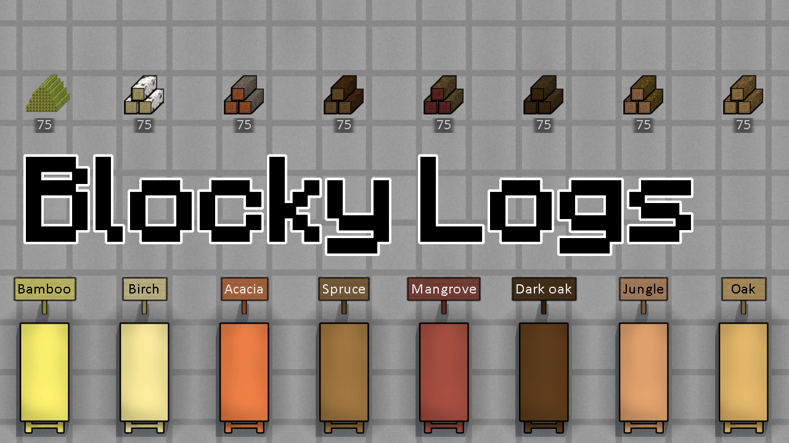

# Blocky Logs

Wood types & colors from Minecraft:
- Acacia
- Bamboo
- Birch
- Dark oak
- Jungle
- Mangrove
- Oak
- Spruce

Matches best with [Blocky Trees](https://steamcommunity.com/sharedfiles/filedetails/?id=2983608933), but not necessarily.
If any mod add trees with matching names, their wood type will be changed.

If [Expanded Woodworking](https://steamcommunity.com/sharedfiles/filedetails/?id=2882494600) is active then corresponding lumber types are also added, along with Minecraft planks texture.

## Verified compatible/supported mods

- [Expanded Woodworking](https://steamcommunity.com/sharedfiles/filedetails/?id=2882494600)
- [Extended Woodworking](https://steamcommunity.com/sharedfiles/filedetails/?id=836912371)

## You may also like...

https://github.com/zed-0xff/RW-BlockyLogs

## Support me

 or [Patreon](https://www.patreon.com/zed_0xff)
